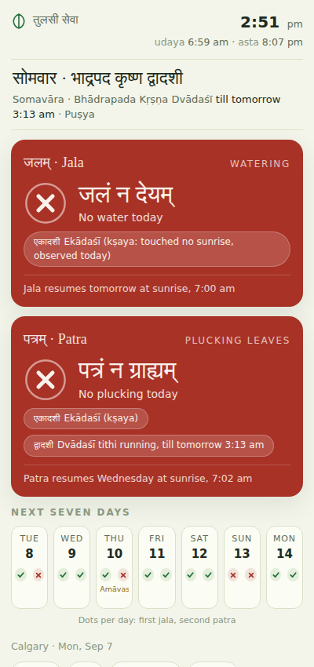
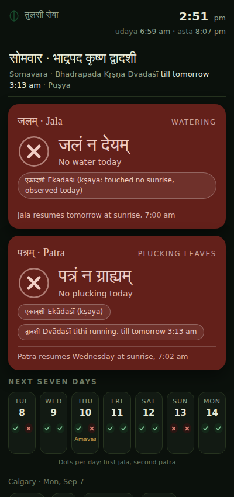
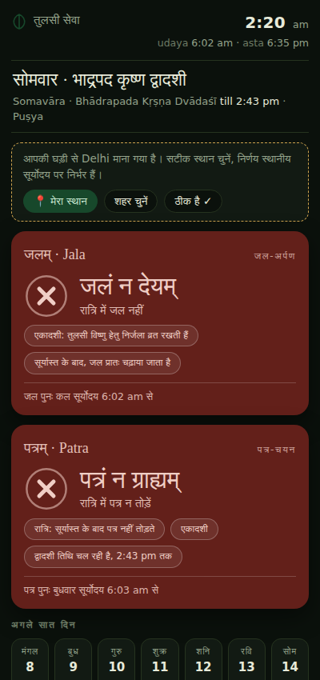

# Tulasī Sevā 🌿

**Should you water tulsī today? Should you pluck the leaves?**
**Live: https://gauravtripathi001.github.io/tulsi-seva/**

A single, self-contained web page that answers both, live - by computing the full pañcāṅga in your browser.

Many Hindu households pause watering tulsī on Ekādaśī (Tulasī herself is held to keep nirjalā ekādaśī for Viṣṇu) and on Sundays, and avoid plucking leaves on Ekādaśī, Dvādaśī, Amāvasyā, Pūrṇimā, Saṅkrānti, Sundays, Tuesdays, after sunset, and during grahaṇa. Remembering all of that against a lunar calendar is exactly what computers are for.

## What it does

- **Two big verdicts** - जलम् (water) and पत्रम् (pluck) - green or red, with the reason (e.g. *"Śukla Ekādaśī - resumes tomorrow at sunrise, 7:01 am"*) and a seven-day outlook.
- **A real pañcāṅga engine, fully in-browser** (via [astronomy-engine](https://github.com/cosinekitty/astronomy), MIT): tithi from lunar elongation, vāra on sunrise-to-sunrise reckoning, udaya-tithi day logic with kṣaya/vṛddhi handling, pūrṇimānta māsa with adhika-māsa detection, nakṣatra, and nirāyaṇa (Lahiri) saṅkrānti. No API, no backend - it works offline after first load.
- **Works anywhere on Earth** - auto-locates from your clock's timezone, one-tap GPS refine, city presets.
- **हिंदी / English**, day/night theme that follows the actual sun at your location, and every rule is a toggle so it matches *your* family's tradition.
- **Grahaṇa windows with sūtaka** for the North-American and Indian skies (through Dec 2029).
- **No ads. No tracking. No accounts.** One HTML file.

## Screenshots

| Day (Calgary) | Night | Hindi (Delhi) |
|---|---|---|
|  |  |  |

## Accuracy

Tithi end-times cross-checked against published pañcāṅgas over a six-month sample agree within ~1 minute; saṅkrānti instants within ~10 minutes (never a different day). Kṣaya cases (a tithi that touches no sunrise - common at northern latitudes) are handled with the standard smārta nirṇaya and labeled on screen. For vrata-critical timing, confirm with your pañcāṅga of record - and where your paramparā differs, use the toggles.

## Run it

Open `index.html`. That's the whole deployment story - host it on any static host, keep it on an old phone by the plant (browser menu → *Add to Home Screen*), or run it from a file.

## Maintenance

The eclipse (`GRAHANA`) table inside the page runs through **Dec 2029**; the page shows a footer warning if it ever lapses. Extend the array with new events (UTC umbral contacts for lunar, partial-phase window for solar; `regions: ['NA']` / `['IN']`) and bump `HORIZON`.

## License

MIT © 2026 Gaurav Tripathi. Astronomy by [astronomy-engine](https://github.com/cosinekitty/astronomy) (MIT © Don Cross).

Made with care in Calgary. Tulasyai namaḥ. 🪴
